# 一、会话

## 1.1 概述

### 1.1.1 为什么需要会话管理

> HTTP是无状态协议

+ 无状态就是不保存状态，即无状态协议(stateless),HTTP协议自身不对请求和响应之间的通信状态进行保存，也就是说在HTTP协议这个级别，协议对于发送过的请求或者响应都不做持久处理
+ 简单理解：服务器不会记录请求是否来自哪个浏览器。

### 1.1.2 会话管理实现的手段

> Cookie和Session配合解决

+ cookie是在客户端保留少量数据的技术，主要是通过响应头向客户端响应一些客户端要保留的信息
+ session是在服务端保留更多数据的技术，主要通过HttpSession对象保存一些和客户端相关的信息
+ cookie和session配合记录请求状态

## 1.2 Cookie

### 1.2.1 Cookie概述

> cookie是一种客户端会话技术，cookie由服务端产生，它是服务器存放在浏览器的一小份数据，浏览器以后每次访问该服务器都会将这小份数据携带到服务器去

+ 服务端创建cookie，将cookie放入响应对象中，Tomcat容器将cookie转化为set-cookie响应头，响应给客户端
+ 客户端在收到cookie的响应头时，在下次请求该服务的资源时，会以cookie请求头的形式携带之前收到的cookie
+ cookie是一种键值对格式的数据,从tomcat8.5开始可以保存中文,但是不推荐
+ 由于cookie是存储于客户端的数据,比较容易暴露,一般不存储一些敏感或者影响安全的数据

> 原理图

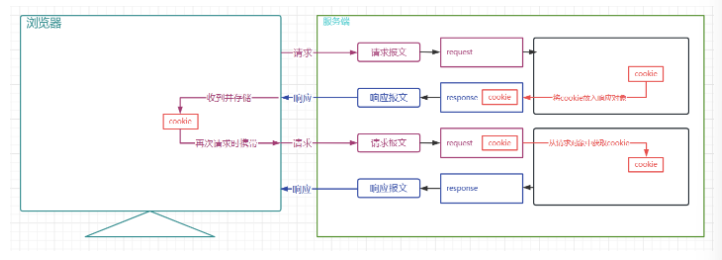

> 应用场景举例

1. 记录用户名

   当我们在用户名的输入框中输入完用户名后,浏览器记录用户名,下一次再访问登录页面时,用户名自动填充到用户名的输入框.

2. 保存电影播放进度

   在网页上播放电影的时候,如果中途退出浏览器了,下载再打开浏览器播放同一部电影的时候,会自动跳转到上次退出时候的进度,因为在播放的时候会将播放进度保存到cookie中

### 1.2.2 Cookie的使用

> servletA向响应中增加Cookie

```java
@WebServlet("/servletA")
public class ServletA extends HttpServlet {
    @Override
    protected void service(HttpServletRequest req, HttpServletResponse resp) throws ServletException, IOException {
        //创建Cookie
        Cookie cookie1 = new Cookie("c1", "c1_value1");
        Cookie cookie2 = new Cookie("c2", "c2_value2");
        //将cookie放入响应对象
        resp.addCookie(cookie1);
        resp.addCookie(cookie2);
    }
}
```

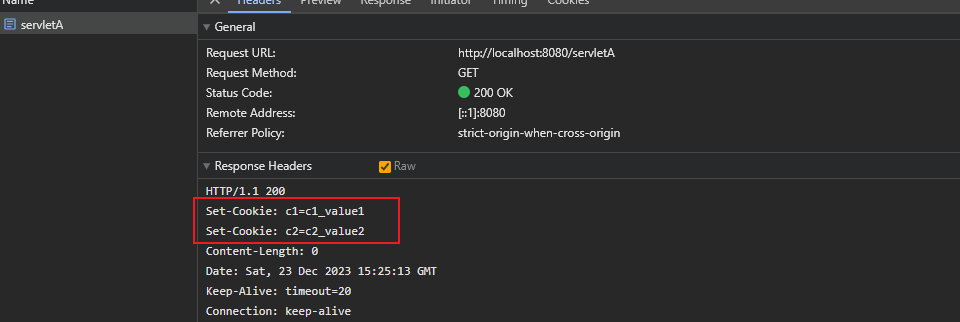

> servletB从请求中读取Cookie

```java
@WebServlet("/servletB")
public class ServletB extends HttpServlet {
    @Override
    protected void service(HttpServletRequest req, HttpServletResponse resp) throws ServletException, IOException {
        //获取请求中的cookie
        Cookie[] cookies = req.getCookies();
        //迭代cookies数组
        if(cookies != null && cookies.length != 0){
            for (Cookie cookie : cookies) {
                System.out.println(cookie.getName()+":"+cookie.getValue());
            }
        }
    }
}
```

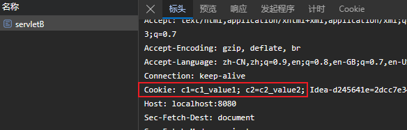

### 1.2.3 Cookie的时效性

> 默认情况下Cookie的有效期是一次会话范围内，我们可以通过cookie的setMaxAge()方法让Cookie持久化保存到浏览器上

+ 会话级Cookie
  + 服务器端并没有明确指定Cookie的存在时间
  + 在浏览器端，Cookie数据存在于内存中
  + 只要浏览器还开着，Cookie数据就一直都在
  + 浏览器关闭，内存中的Cookie数据就会被释放
+ 持久化Cookie
  + 服务器端明确设置了Cookie的存在时间
  + 在浏览器端，Cookie数据会被保存到硬盘上
  + Cookie在硬盘上存在的时间根据服务器端限定的时间来管控，不受浏览器关闭的影响
  + 持久化Cookie到达了预设的时间会被释放

> cookie.setMaxAge(int expiry)参数单位是秒，表示cookie的持久化时间，如果设置参数为0，表示将浏览器中保存的该cookie删除

```java
@WebServlet("/servletA")
public class ServletA extends HttpServlet {
    @Override
    protected void service(HttpServletRequest req, HttpServletResponse resp) throws ServletException, IOException {
        //创建Cookie
        Cookie cookie1 = new Cookie("c1", "c1_value1");
        cookie1.setMaxAge(60);
        Cookie cookie2 = new Cookie("c2", "c2_value2");
        //将cookie放入响应对象
        resp.addCookie(cookie1);
        resp.addCookie(cookie2);
    }
}
```

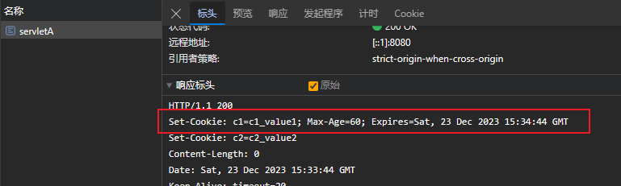

### 1.2.4 Cookie的提交路径

> 访问互联网资源时不能每次都需要把所有Cookie带上。访问不同的资源时，可以携带不同的cookie，我们可以通过cookie的setPath(String path) 对cookie的路径进行设置

+ 从ServletA中获取cookie

```java
@WebServlet("/servletA")
public class ServletA extends HttpServlet {
    @Override
    protected void service(HttpServletRequest req, HttpServletResponse resp) throws ServletException, IOException {
        //创建Cookie
        Cookie cookie1 = new Cookie("c1", "c1_value1");
//        cookie1.setMaxAge(60);
        //设置cookie的提交路径
        cookie1.setPath("/demo01-cookie/servletB");
        Cookie cookie2 = new Cookie("c2", "c2_value2");
        //将cookie放入响应对象
        resp.addCookie(cookie1);
        resp.addCookie(cookie2);
    }
}
```

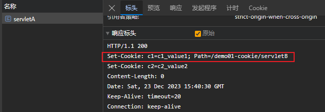

+ 向ServletB请求时携带了c1

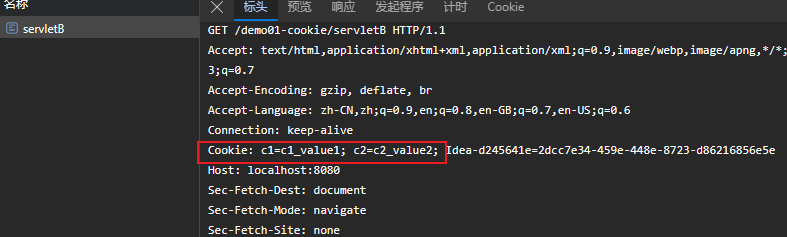

+ 向其他资源请求时就不携带c1了

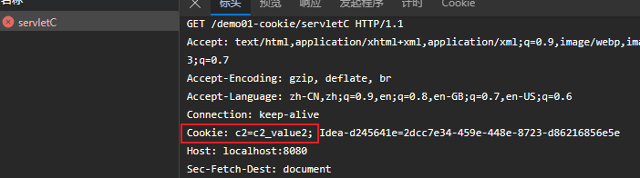

## 1.3 Session

### 1.3.1 HttpSession概述

> HttpSession是一种保留更多信息在服务端的一种技术，服务器会为每一个客户端开辟一块内存空间，即session对象，客户端在发送请求时，都可以使用自己的session。这样服务端就可以通过session来记录某个客户端的状态了

+ 服务端在为客户端创建session时，会同时将session对象的id，即`JSESSIONID`以cookie的形式放入响应对象
+ 后端创建完session后，客户端会收到一个特殊的cookie，叫做`JSESSIONID`
+ 客户端下一次请求时携带`JSESSIONID`,后端收到后，根据`JSESSIONID`找到对应的session对象
+ 通过该机制,服务端通过session就可以存储一些专门针对某个客户端的信息了
+ session也是域对象

> 原理图

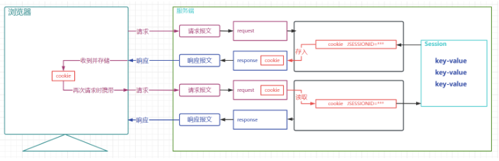

> 应用场景

1. 记录用户的登录状态

   用户登录后,将用户的账号等敏感信息存入session

2. 记录用户操作的历史

   例如记录用户的访问痕迹,用户的购物车信息等临时性的信息

### 1.3.2 HttpSession的使用

> 用户提交form表单到ServletA，携带用户名，ServletA获取session将用户名存到Session，用户再请求其他任意Servlet，获取之前存储的用户

+ 定义表单页，提交用户名

```html
<form action = "servletA" method="post">
    用户名：
    <input type="text" name="username">
    <input type="submit" value="提交">
</form>
```

+ 定义ServletA，将用户名存入session

```java
@WebServlet("/servletA")
public class ServletA extends HttpServlet {
    @Override
    protected void service(HttpServletRequest req, HttpServletResponse resp) throws ServletException, IOException {
        //获取请求中的参数
        String username = req.getParameter("username");
        //获取session对象
        HttpSession session = req.getSession();
        //获取Session的ID
        String jSessionId = session.getId();
        System.out.println(jSessionId);
        //判断session是不是新创建的session
        boolean isNew = session.isNew();
        System.out.println(isNew);
        //向session对象中存入数据
        session.setAttribute("username",username);
    }
}
```

+ 响应中收到了一个JSESSIONID

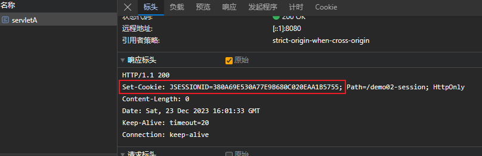

+ 定义其他的Servlet，从session中读取用户名

```java
@WebServlet("/servletB")
public class ServletB extends HttpServlet {
    @Override
    protected void service(HttpServletRequest req, HttpServletResponse resp) throws ServletException, IOException {
        //获取session对象
        HttpSession session = req.getSession();
        //获取session的Id
        String id = session.getId();
        System.out.println(id);
        //判断是不是新创建的session
        boolean isNew = session.isNew();
        System.out.println(isNew);
        //从session中取出数据
        String username = (String) session.getAttribute("username");
        System.out.println(username);
    }
}
```

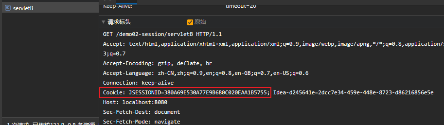

> getSession方法的处理逻辑图

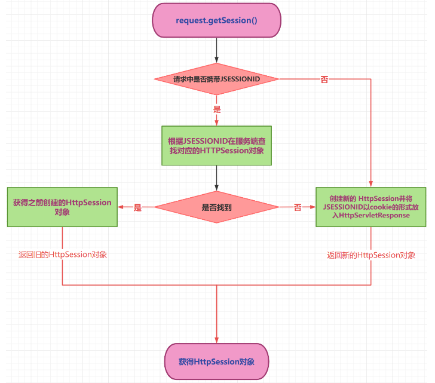

### 1.3.3 HttpSession的时效性

> 为什么要设置session的时效

+ 用户量很大之后，如果不释放，服务端内存迟早被耗尽
+ 客户端关闭行为无法被服务端直接侦测，或者客户端较长时间不操作，类似这些情况就需要对session的时限进行设置了

> 默认的session最大闲置时间(两次使用同一个session中的间隔时间) 在tomcat/conf/web.xml配置为30分钟

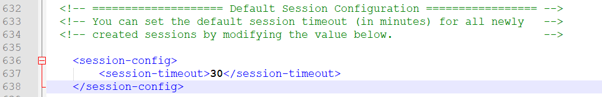

> 我们可以自己在当前项目的web.xml对最大闲置时间进行设置

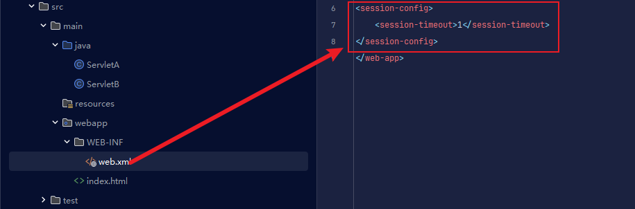

> 也可以通过HttpSession的API对最大闲置时间进行设定

```java
//设置最大闲置时间
session.setMaxInactiveInterval(60);
```

> 也可以直接让session失效

```java
session.invalidate();
```

## 1.4 三大域对象

### 1.4.1 域对象概述

> 域对象：一些用于存储数据和传递数据的对象，传递数据不同的范围，我们称之为不同的域，不同的域对象代表不同的域，共享数据的范围也不同

+ web项目中，我们一定要熟练使用的域对象是 **请求域，会话域，应用域**
+ 请求域对象是HttpServletRequest，传递数据的范围是一次请求之内及请求转发
+ 会话域对象是HttpSession，传递数据的范围是一次会话之内，可以跨多个请求
+ 应用域对象是ServletContext，传递数据的范围是本应用之内，可以跨多个会话

> 生活举例: 热水器摆放位置不同,使用的范围就不同

1. 摆在张三工位下,就只有张三一个人能用
2. 摆在办公室的公共区,办公室内的所有人都可以用
3. 摆在楼层的走廊区,该楼层的所有人都可以用

> 三大域对象的数据作用范围图解

+ 请求域

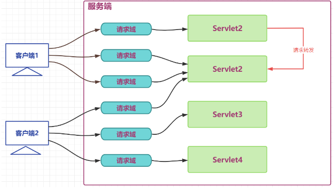

+ 会话域

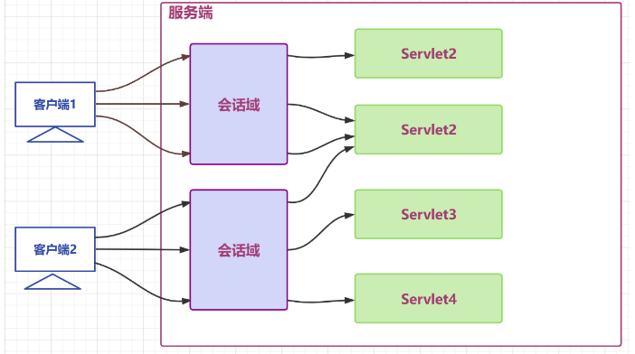

+ 应用域

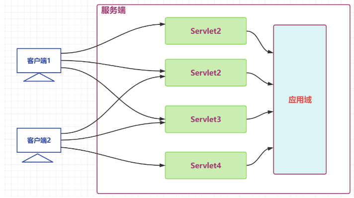

+ 所有域

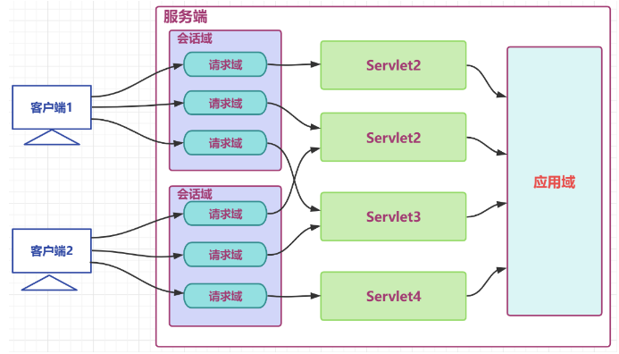

### 1.4.2 域对象的使用

> 域对象的API

| API                                         | 功能                    |
| ------------------------------------------- | ----------------------- |
| void setAttribute(String name,String value) | 向域对象中添加/修改数据 |
| Object getAttribute(String name);           | 从域对象中获取数据      |
| removeAttribute(String name);               | 移除域对象中的数据      |

> API测试

+ ServletC向三大域中放入数据

``` java
@WebServlet("/servletC")
public class ServletC extends HttpServlet {
    @Override
    protected void service(HttpServletRequest req, HttpServletResponse resp) throws ServletException, IOException {
        //向请求域中放入数据
        req.setAttribute("request","req-Msg");
        //向会话域中放入数据
        HttpSession session = req.getSession();
        session.setAttribute("session","ses-Msg");
        //向应用域中放入数据
        ServletContext application = getServletContext();
        application.setAttribute("application","app-Msg");
    }
}
```

+ ServletD从三大于中取出数据

``` java
@WebServlet("/servletD")
public class ServletD extends HttpServlet {
    @Override
    protected void service(HttpServletRequest req, HttpServletResponse resp) throws ServletException, IOException {
        //从请求域中获取数据
        String reqMsg = (String) req.getAttribute("request");
        System.out.println(reqMsg);
        //从会话域中获取数据
        HttpSession session = req.getSession();
        String sessionMsg = (String) session.getAttribute("session");
        System.out.println(sessionMsg);

        //从应用域中获取数据
        ServletContext application = getServletContext();
        String appMsg = (String) application.getAttribute("application");
        System.out.println(appMsg);
    }
}
```


+ 请求转发时,请求域可以传递数据`请求域内一般放本次请求业务有关的数据,如:查询到的所有的部门信息`
+ 同一个会话内,不用请求转发,会话域可以传递数据`会话域内一般放本次会话的客户端有关的数据,如:当前客户端登录的用户` 
+ 同一个APP内,不同的客户端,应用域可以传递数据`应用域内一般放本程序应用有关的数据 如:Spring框架的IOC容器`

# 二、过滤器

## 2.1 过滤器概述

> Filter,即过滤器，是JAVAEE技术规范之一，作用目标资源的请求进行过滤的一套技术规范。

+ Filter接口定义了过滤器的开发规范,所有的过滤器都要实现该接口
+ Filter的工作位置是项目中所有目标资源之前,容器在创建HttpServletRequest和HttpServletResponse对象后,会先调用Filter的doFilter方法

+ Filter的doFilter方法可以控制请求是否继续,如果放行,则请求继续,如果拒绝,则请求到此为止,由过滤器本身做出响应

+ Filter不仅可以对请求做出过滤,也可以在目标资源做出响应前,对响应再次进行处理
+ Filter是GOF中责任链模式的典型案例
+ Filter的常用应用包括但不限于: 登录权限检查,解决网站乱码,过滤敏感字符,日志记录,性能分析... ...

> 生活举例：公司前台，停车场安保，地铁验票

> 过滤器开发中应用的场景

+ 日志的记录
+ 性能的分析
+ 乱码的处理
+ 事务的控制
+ 登录的控制
+ 跨域的处理
+ ......

> 图解

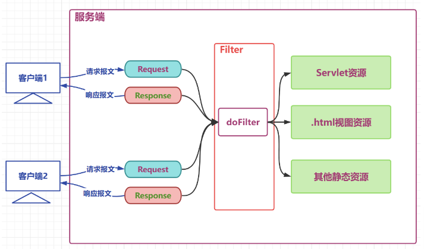

> Filter接口API

+ 源码

```java
public interface Filter {
    default void init(FilterConfig filterConfig) throws ServletException {
    }

    void doFilter(ServletRequest var1, ServletResponse var2, FilterChain var3) throws IOException, ServletException;

    default void destroy() {
    }
}
```

+ API目标

| API                                                          | 目标                                                         |
| ------------------------------------------------------------ | ------------------------------------------------------------ |
| default public void init(FilterConfig filterConfig)          | 初始化方法，由容器调用并传入初始配置信息filterConfig对象     |
| public void doFilter(ServletRequest request, ServletResponse response, FilterChain chain) | 过滤方法,核心方法,过滤请求,决定是否放行,响应之前的其他处理等都在该方法中 |
| default public void destroy()                                | 销毁方法,容器在回收过滤器对象之前调用的方法                  |

## 2.2 过滤器使用

> 目标：开发一个日志记录过滤器

+ 用户请求到达目标资源之前，记录用户的请求资源路径
+ 响应之前记录本次请求目标资源运算的耗时
+ 可以选择将日志记录进入文件，为了方便测试，这里将日志直接在控制台打印

> 定义一个过滤器类，编写功能代码

```java
public class LoggingFilter implements Filter {
    private SimpleDateFormat dateFormat = new SimpleDateFormat("yyyy-MM-dd HH:mm:ss");
    @Override
    public void doFilter(ServletRequest servletRequest, ServletResponse servletResponse, FilterChain filterChain) throws IOException, ServletException {
        //参考父转子
        HttpServletRequest request = (HttpServletRequest) servletRequest;
        HttpServletResponse response = (HttpServletResponse) servletResponse;
        //拼接日志文本
        String requestURI = request.getRequestURI();
        String time = dateFormat.format(new Date());
        String beforeLogging = requestURI+"在"+time+"被请求了";
        //打印日志
        System.out.println(beforeLogging);
        //获取系统时间
        long t1 = System.currentTimeMillis();
        //放行请求
        filterChain.doFilter(request,response);
        //获取系统时间
        long t2 = System.currentTimeMillis();
        //拼接日志文本
        String afterLogging = requestURI+"在"+time+"的请求耗时："+(t2-t1)+"毫秒";
        //打印日志
        System.out.println(afterLogging);
    }
}
```

+ 说明
  + doFilter方法中的请求和响应对象是以父接口的形式声明的,实际传入的实参就是HttpServletRequest和HttpServletResponse子接口级别的,可以安全强转
  + filterChain.doFilter(request,response); 这行代码的功能是放行请求,如果没有这一行代码,则请求到此为止
  + filterChain.doFilter(request,response);在放行时需要传入request和response,意味着请求和响应对象要继续传递给后续的资源,这里没有产生新的request和response对象

> 定义两个Servlet作为目标资源

+ ServletA

```java
@WebServlet(urlPatterns = "/servletA",name = "servletAName")
public class ServletA extends HttpServlet {
    @Override
    protected void service(HttpServletRequest req, HttpServletResponse resp) throws ServletException, IOException {
        //处理器请求
        System.out.println("servletA处理请求的方法,耗时10毫秒");
        //模拟处理请求耗时
        try {
            Thread.sleep(10);
        }catch (InterruptedException e){
            throw new RuntimeException(e);
        }
    }
}
```

+ ServletB

```java
@WebServlet(urlPatterns = "/servletB",name = "servletBName")
public class ServletB extends HttpServlet {
    @Override
    protected void service(HttpServletRequest req, HttpServletResponse resp) throws ServletException, IOException {
        // 处理器请求
        System.out.println("servletB处理请求的方法,耗时10毫秒");
        // 模拟处理请求耗时
        try {
            Thread.sleep(10);
        } catch (InterruptedException e) {
            throw new RuntimeException(e);
        }
    }
}
```

> 配置过滤器以及过滤器的过滤范围

+ web.xml

```xml
<?xml version="1.0" encoding="UTF-8"?>
<web-app xmlns="http://xmlns.jcp.org/xml/ns/javaee"
	xmlns:xsi="http://www.w3.org/2001/XMLSchema-instance"
	xsi:schemaLocation="http://xmlns.jcp.org/xml/ns/javaee http://xmlns.jcp.org/xml/ns/javaee/web-app_4_0.xsd"
	version="4.0">
<!--配置filter，并为filter起别名-->
	<filter>
		<filter-name>loggingFilter</filter-name>
		<filter-class>LoggingFilter</filter-class>
	</filter>
<!--为别名对应的filter配置要过滤的目标资源-->
	<filter-mapping>
		<filter-name>loggingFilter</filter-name>
		<!--通过映射路径确定过滤资源-->
		<url-pattern>/servletA</url-pattern>
		<!--通过后缀名确定过滤资源-->
		<url-pattern>*.html</url-pattern>
		<!--通过servlet别名确定过滤资源-->
		<servlet-name>servletBName</servlet-name>
	</filter-mapping>
</web-app>
```

+ 说明

  + filter-mapping标签中定义了过滤器对那些资源进行过滤
  + 子标签url-pattern通过映射路径确定过滤范围
    + /servletA  精确匹配,表示对servletA资源的请求进行过滤
    + *.html 表示对以.action结尾的路径进行过滤
    + /* 表示对所有资源进行过滤
    + 一个filter-mapping下可以配置多个url-pattern
  + 子标签servlet-name通过servlet别名确定对那些servlet进行过滤
    + 使用该标签确定目标资源的前提是servlet已经起了别名
    + 一个filter-mapping下可以定义多个servlet-name
    + 一个filter-mapping下,servlet-name和url-pattern子标签可以同时存在

> 过滤过程图解

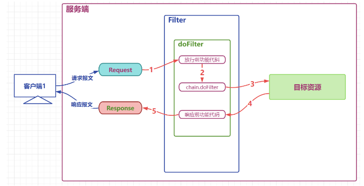

## 2.3 过滤器生命周期

> 过滤器作为web项目的组件之一,和Servlet的生命周期类似,略有不同,没有servlet的load-on-startup的配置,默认就是系统启动立刻构造

| 阶段       | 对应方法                                                     | 执行时机      | 执行次数 |
| ---------- | ------------------------------------------------------------ | ------------- | -------- |
| 创建对象   | 构造器                                                       | web应用启动时 | 1        |
| 初始化方法 | void init(FilterConfig filterConfig)                         | 构造完毕      | 1        |
| 过滤请求   | void doFilter(ServletRequest servletRequest, ServletResponse servletResponse, FilterChain filterChain) | 每次请求      | 多次     |
| 销毁       | default void destroy()                                       | web应用关闭时 | 1        |

## 2.4 过滤器链的使用

> 一个web项目中,可以同时定义多个过滤器,多个过滤器对同一个资源进行过滤时,工作位置有先后,整体形成一个工作链,称之为过滤器链

+ 过滤器链中的过滤器的顺序由filter-mapping顺序决定
+ 每个过滤器过滤的范围不同,针对同一个资源来说,过滤器链中的过滤器个数可能是不同的

+ 如果某个Filter是使用ServletName进行匹配规则的配置，那么这个Filter执行的优先级要更低

> 图

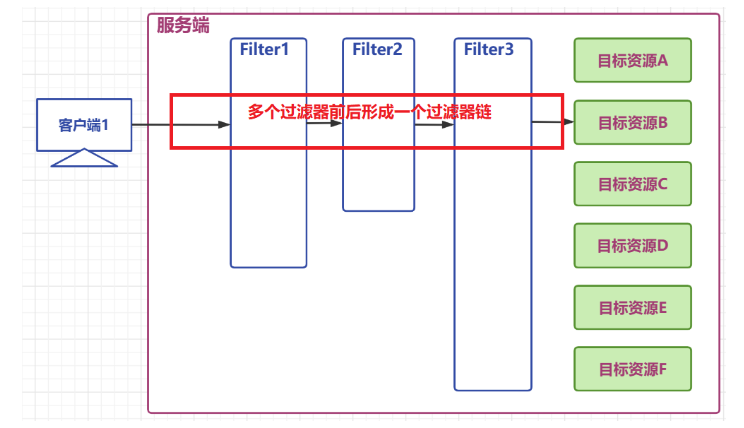

> 过滤器链功能测试

+ 定义三个过滤器，对目标资源Servlet的请求进行过滤
+ 目标资源Servlet资源代码

```java
@WebServlet("/servlet")
public class Servlet extends HttpServlet {
    @Override
    protected void service(HttpServletRequest req, HttpServletResponse resp) throws ServletException, IOException {
        System.out.println("servlet method invoked");
    }
}
```

+ 三个过滤器代码

```java
public class Filter1 implements Filter {
    @Override
    public void doFilter(ServletRequest servletRequest, ServletResponse servletResponse, FilterChain filterChain) throws IOException, ServletException {
        System.out.println("filter1");
        filterChain.doFilter(servletRequest,servletResponse);
        System.out.println("filter1 chain.doFilter");
    }
}
public class Filter2 implements Filter {
    @Override
    public void doFilter(ServletRequest servletRequest, ServletResponse servletResponse, FilterChain filterChain) throws IOException, ServletException {
        System.out.println("filter2");
        filterChain.doFilter(servletRequest, servletResponse);
        System.out.println("filter2 chain.doFilter");
    }
}
public class Filter3 implements Filter {
    @Override
    public void doFilter(ServletRequest servletRequest, ServletResponse servletResponse, FilterChain filterChain) throws IOException, ServletException {
        System.out.println("filter3");
        filterChain.doFilter(servletRequest, servletResponse);
        System.out.println("filter3 chain.doFilter");
    }
}
```

+ 过滤器配置代码

```xml
<?xml version="1.0" encoding="UTF-8"?>
<web-app xmlns="http://xmlns.jcp.org/xml/ns/javaee"
	xmlns:xsi="http://www.w3.org/2001/XMLSchema-instance"
	xsi:schemaLocation="http://xmlns.jcp.org/xml/ns/javaee http://xmlns.jcp.org/xml/ns/javaee/web-app_4_0.xsd"
	version="4.0">
<filter>
	<filter-name>filter1</filter-name>
	<filter-class>Filter1</filter-class>
</filter>
	<filter>
		<filter-name>filter2</filter-name>
		<filter-class>Filter2</filter-class>
	</filter>
	<filter>
		<filter-name>filter3</filter-name>
		<filter-class>Filter3</filter-class>
	</filter>
	<!--filter-mapping的顺序决定了过滤器的工作顺序-->
	<filter-mapping>
		<filter-name>filter1</filter-name>
		<url-pattern>/servlet</url-pattern>
	</filter-mapping>
	<filter-mapping>
		<filter-name>filter2</filter-name>
		<url-pattern>/servlet</url-pattern>
	</filter-mapping>
	<filter-mapping>
		<filter-name>filter3</filter-name>
		<url-pattern>/servlet</url-pattern>
	</filter-mapping>
</web-app>
```

> 运行结果

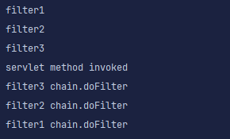

> 图解

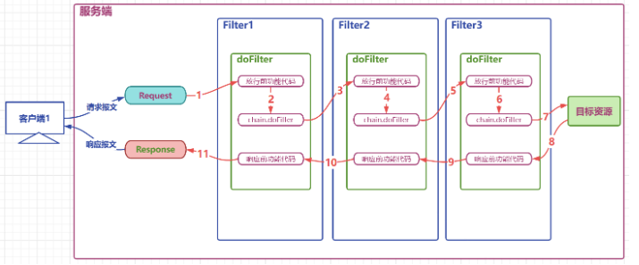

## 2.5 注解方式配置过滤器

> @WebFilter注解的使用

+ 源码

```java
@Target({ElementType.TYPE})
@Retention(RetentionPolicy.RUNTIME)
@Documented
public @interface WebFilter {
    String description() default "";

    String displayName() default "";

    WebInitParam[] initParams() default {};

    String filterName() default "";

    String smallIcon() default "";

    String largeIcon() default "";

    String[] servletNames() default {};

    String[] value() default {};

    String[] urlPatterns() default {};

    DispatcherType[] dispatcherTypes() default {DispatcherType.REQUEST};

    boolean asyncSupported() default false;
}
```

+ 注解方式实现

```java
package com.atguigu.filters;


import jakarta.servlet.*;
import jakarta.servlet.annotation.WebFilter;
import jakarta.servlet.annotation.WebInitParam;
import jakarta.servlet.http.HttpServletRequest;
import jakarta.servlet.http.HttpServletResponse;

import java.io.IOException;
import java.text.SimpleDateFormat;
import java.util.Date;


@WebFilter(
        filterName = "loggingFilter",
        initParams = {@WebInitParam(name="dateTimePattern",value="yyyy-MM-dd HH:mm:ss")},
        urlPatterns = {"/servletA","*.html"},
        servletNames = {"servletBName"}
)
public class LoggingFilter  implements Filter {
    private SimpleDateFormat dateFormat ;

    /*init初始化方法,通过filterConfig获取初始化参数
    * init方法中,可以用于定义一些其他初始化功能代码
    * */
    @Override
    public void init(FilterConfig filterConfig) throws ServletException {
        // 获取初始参数
        String dateTimePattern = filterConfig.getInitParameter("dateTimePattern");
        // 初始化成员变量
        dateFormat=new SimpleDateFormat(dateTimePattern);
    }
    @Override
    public void doFilter(ServletRequest servletRequest, ServletResponse servletResponse, FilterChain filterChain) throws IOException, ServletException {
        // 参数父转子
        HttpServletRequest request =(HttpServletRequest)  servletRequest;
        HttpServletResponse  response =(HttpServletResponse)  servletResponse;
        // 拼接日志文本
        String requestURI = request.getRequestURI();
        String time = dateFormat.format(new Date());
        String beforeLogging =requestURI+"在"+time+"被请求了";
        // 打印日志
        System.out.println(beforeLogging);
        // 获取系统时间
        long t1 = System.currentTimeMillis();
        // 放行请求
        filterChain.doFilter(request,response);
        // 获取系统时间
        long t2 = System.currentTimeMillis();
        String afterLogging =requestURI+"在"+time+"的请求耗时:"+(t2-t1)+"毫秒";
        // 打印日志
        System.out.println(afterLogging);

    }
}
```

# 三、监听器

## 3.1 监听器概述

> 监听器：专门用于对域对象对象身上发生的事件或状态改变进行监听和相应处理的对象

+ 监听器是GOF设计模式中,观察者模式的典型案例
+ 观察者模式: 当被观察的对象发生某些改变时, 观察者自动采取对应的行动的一种设计模式

+ 监听器使用的感受类似JS中的事件,被观察的对象发生某些情况时,自动触发代码的执行
+ 监听器并不监听web项目中的所有组件,仅仅是对三大域对象做相关的事件监听

> 监听器的分类

+ web中定义八个监听器接口作为监听器的规范,这八个接口按照不同的标准可以形成不同的分类

+ 按监听的对象划分
  + application域监听器 ServletContextListener  ServletContextAttributeListener 
  + session域监听器 HttpSessionListener  HttpSessionAttributeListener  HttpSessionBindingListener  HttpSessionActivationListener  
  + request域监听器 ServletRequestListener  ServletRequestAttributeListener 
+ 按监听的事件分
  + 域对象的创建和销毁监听器 ServletContextListener   HttpSessionListener   ServletRequestListener  
  + 域对象数据增删改事件监听器 ServletContextAttributeListener  HttpSessionAttributeListener   ServletRequestAttributeListener 
  + 其他监听器  HttpSessionBindingListener  HttpSessionActivationListener  

## 3.2 监听器的六个主要接口

### 3.2.1 application域监听器

> ServletContextListener  监听ServletContext对象的创建与销毁

| 方法名                                      | 作用                     |
| ------------------------------------------- | ------------------------ |
| contextInitialized(ServletContextEvent sce) | ServletContext创建时调用 |
| contextDestroyed(ServletContextEvent sce)   | ServletContext销毁时调用 |

+ ServletContextEvent对象代表从ServletContext对象身上捕获到的事件，通过这个事件对象我们可以获取到ServletContext对象。

> ServletContextAttributeListener 监听ServletContext中属性的添加、移除和修改

| 方法名                                               | 作用                                 |
| ---------------------------------------------------- | ------------------------------------ |
| attributeAdded(ServletContextAttributeEvent scab)    | 向ServletContext中添加属性时调用     |
| attributeRemoved(ServletContextAttributeEvent scab)  | 从ServletContext中移除属性时调用     |
| attributeReplaced(ServletContextAttributeEvent scab) | 当ServletContext中的属性被修改时调用 |

+ ServletContextAttributeEvent对象代表属性变化事件，它包含的方法如下：

| 方法名              | 作用                     |
| ------------------- | ------------------------ |
| getName()           | 获取修改或添加的属性名   |
| getValue()          | 获取被修改或添加的属性值 |
| getServletContext() | 获取ServletContext对象   |

> 测试代码

+ 定义监听器

```java
import jakarta.servlet.*;
import jakarta.servlet.annotation.WebListener;

@WebListener
public class ApplicationListener implements ServletContextListener, ServletContextAttributeListener {
    //初始化监听器
    @Override
    public void contextInitialized(ServletContextEvent sce) {
        ServletContext application = sce.getServletContext();
        System.out.println("application"+application.hashCode()+"initialized");
    }
    //监听器销毁
    @Override
    public void contextDestroyed(ServletContextEvent sce) {
        ServletContext application = sce.getServletContext();
        System.out.println("application"+application.hashCode()+"destroyed");
    }
    //监听器数据增加
    @Override
    public void attributeAdded(ServletContextAttributeEvent event) {
        String name = event.getName();
        Object value = event.getValue();
        ServletContext application = event.getServletContext();
        System.out.println("application"+application.hashCode()+"add:"+name+"="+value);
    }
    //监听数据移除
    @Override
    public void attributeRemoved(ServletContextAttributeEvent event) {
        String name = event.getName();
        Object value = event.getValue();
        ServletContext servletContext = event.getServletContext();
        System.out.println("servletContext"+servletContext.hashCode()+"remove:"+name+"="+value);
    }
    //监听数据修改
    @Override
    public void attributeReplaced(ServletContextAttributeEvent event) {
        String name = event.getName();
        Object value = event.getValue();
        ServletContext servletContext = event.getServletContext();
        Object newValue = servletContext.getAttribute(name);
        System.out.println("servletContext"+servletContext.hashCode()+"change:"+name+"="+value+"to"+newValue);
    }
}
```

+ 定义出发监听器代码

```java
// ServletA用于向application域中放入数据
@WebServlet(urlPatterns = "/servletA",name = "servletAName")
public class ServletA extends HttpServlet {
    @Override
    protected void service(HttpServletRequest req, HttpServletResponse resp) throws ServletException, IOException {
        // 向application域中放入数据
        ServletContext application = this.getServletContext();
        application.setAttribute("k1","v1");
        application.setAttribute("k2","v2");
    }
}


// ServletB用于向application域中修改和移除数据
@WebServlet(urlPatterns = "/servletB", name = "servletBName")
public class ServletB extends HttpServlet {
    @Override
    protected void service(HttpServletRequest req, HttpServletResponse resp) throws ServletException, IOException {
        ServletContext appliation  = getServletContext();
        //  修改application域中的数据
        appliation.setAttribute("k1","value1");
        //  删除application域中的数据
        appliation.removeAttribute("k2");
    }
}
```

### 3.2.2 session域监听器

> HttpSessionListener  监听HttpSession对象的创建与销毁

| 方法名                                 | 作用                      |
| -------------------------------------- | ------------------------- |
| sessionCreated(HttpSessionEvent hse)   | HttpSession对象创建时调用 |
| sessionDestroyed(HttpSessionEvent hse) | HttpSession对象销毁时调用 |

+ HttpSessionEvent对象代表从HttpSession对象身上捕获到的事件，通过这个事件对象我们可以获取到触发事件的HttpSession对象。

> HttpSessionAttributeListener 监听HttpSession中属性的添加、移除和修改

| 方法名                                        | 作用                              |
| --------------------------------------------- | --------------------------------- |
| attributeAdded(HttpSessionBindingEvent se)    | 向HttpSession中添加属性时调用     |
| attributeRemoved(HttpSessionBindingEvent se)  | 从HttpSession中移除属性时调用     |
| attributeReplaced(HttpSessionBindingEvent se) | 当HttpSession中的属性被修改时调用 |

+ HttpSessionBindingEvent对象代表属性变化事件，它包含的方法如下：

| 方法名       | 作用                          |
| ------------ | ----------------------------- |
| getName()    | 获取修改或添加的属性名        |
| getValue()   | 获取被修改或添加的属性值      |
| getSession() | 获取触发事件的HttpSession对象 |

> 测试代码

+ 定义监听器

```java
package com.atguigu.listeners;

import jakarta.servlet.*;
import jakarta.servlet.annotation.WebListener;
import jakarta.servlet.http.*;


@WebListener
public class SessionListener implements HttpSessionListener, HttpSessionAttributeListener {
    // 监听session创建
    @Override
    public void sessionCreated(HttpSessionEvent se) {
        HttpSession session = se.getSession();
        System.out.println("session"+session.hashCode()+" created");
    }

    // 监听session销毁
    @Override
    public void sessionDestroyed(HttpSessionEvent se) {
        HttpSession session = se.getSession();
        System.out.println("session"+session.hashCode()+" destroyed");
    }
    // 监听数据增加
    @Override
    public void attributeAdded(HttpSessionBindingEvent se) {
        String name = se.getName();
        Object value = se.getValue();
        HttpSession session = se.getSession();
        System.out.println("session"+session.hashCode()+" add:"+name+"="+value);
    }
    // 监听数据移除
    @Override
    public void attributeRemoved(HttpSessionBindingEvent se) {
        String name = se.getName();
        Object value = se.getValue();
        HttpSession session = se.getSession();
        System.out.println("session"+session.hashCode()+" remove:"+name+"="+value);
    }
    // 监听数据修改
    @Override
    public void attributeReplaced(HttpSessionBindingEvent se) {
        String name = se.getName();
        Object value = se.getValue();
        HttpSession session = se.getSession();
        Object newValue = session.getAttribute(name);
        System.out.println("session"+session.hashCode()+" change:"+name+"="+value+" to "+newValue);
    }

}
```

+ 定义出发监听器的代码

```java
// servletA用于创建session并向session中放数据
@WebServlet(urlPatterns = "/servletA",name = "servletAName")
public class ServletA extends HttpServlet {
    @Override
    protected void service(HttpServletRequest req, HttpServletResponse resp) throws ServletException, IOException {
        // 创建session,并向session中放入数据
        HttpSession session = req.getSession();

        session.setAttribute("k1","v1");
        session.setAttribute("k2","v2");
    }
}


// servletB用于修改删除session中的数据并手动让session不可用
@WebServlet(urlPatterns = "/servletB", name = "servletBName")
public class ServletB extends HttpServlet {
    @Override
    protected void service(HttpServletRequest req, HttpServletResponse resp) throws ServletException, IOException {
        HttpSession session = req.getSession();
        //  修改session域中的数据
        session.setAttribute("k1","value1");
        //  删除session域中的数据
        session.removeAttribute("k2");
        // 手动让session不可用
        session.invalidate();
    }
}
```

### 3.2.3 request域监听器

> ServletRequestListener 监听ServletRequest对象的创建与销毁

| 方法名                                      | 作用                         |
| ------------------------------------------- | ---------------------------- |
| requestInitialized(ServletRequestEvent sre) | ServletRequest对象创建时调用 |
| requestDestroyed(ServletRequestEvent sre)   | ServletRequest对象销毁时调用 |

+ ServletRequestEvent对象代表从HttpServletRequest对象身上捕获到的事件，通过这个事件对象我们可以获取到触发事件的HttpServletRequest对象。另外还有一个方法可以获取到当前Web应用的ServletContext对象。

> ServletRequestAttributeListener 监听ServletRequest中属性的添加、移除和修改

| 方法名                                               | 作用                                 |
| ---------------------------------------------------- | ------------------------------------ |
| attributeAdded(ServletRequestAttributeEvent srae)    | 向ServletRequest中添加属性时调用     |
| attributeRemoved(ServletRequestAttributeEvent srae)  | 从ServletRequest中移除属性时调用     |
| attributeReplaced(ServletRequestAttributeEvent srae) | 当ServletRequest中的属性被修改时调用 |

+ ServletRequestAttributeEvent对象代表属性变化事件，它包含的方法如下：

| 方法名               | 作用                             |
| -------------------- | -------------------------------- |
| getName()            | 获取修改或添加的属性名           |
| getValue()           | 获取被修改或添加的属性值         |
| getServletRequest () | 获取触发事件的ServletRequest对象 |

+ 定义监听器

```java
package com.atguigu.listeners;

import jakarta.servlet.*;
import jakarta.servlet.annotation.WebListener;


@WebListener
public class RequestListener implements ServletRequestListener , ServletRequestAttributeListener {
    // 监听初始化
    @Override
    public void requestInitialized(ServletRequestEvent sre) {
        ServletRequest request = sre.getServletRequest();
        System.out.println("request"+request.hashCode()+" initialized");
    }

    // 监听销毁
    @Override
    public void requestDestroyed(ServletRequestEvent sre) {
        ServletRequest request = sre.getServletRequest();
        System.out.println("request"+request.hashCode()+" destoryed");
    }


    // 监听数据增加
    @Override
    public void attributeAdded(ServletRequestAttributeEvent srae) {
        String name = srae.getName();
        Object value = srae.getValue();
        ServletRequest request = srae.getServletRequest();
        System.out.println("request"+request.hashCode()+" add:"+name+"="+value);
    }

    //  监听数据移除
    @Override
    public void attributeRemoved(ServletRequestAttributeEvent srae) {
        String name = srae.getName();
        Object value = srae.getValue();
        ServletRequest request = srae.getServletRequest();
        System.out.println("request"+request.hashCode()+" remove:"+name+"="+value);
    }
    // 监听数据修改
    @Override
    public void attributeReplaced(ServletRequestAttributeEvent srae) {
        String name = srae.getName();
        Object value = srae.getValue();
        ServletRequest request = srae.getServletRequest();
        Object newValue = request.getAttribute(name);
        System.out.println("request"+request.hashCode()+" change:"+name+"="+value+" to "+newValue);
    }
}
```

+ 定义出发监听器的代码

```java
//  servletA向请求域中放数据
@WebServlet(urlPatterns = "/servletA",name = "servletAName")
public class ServletA extends HttpServlet {
    @Override
    protected void service(HttpServletRequest req, HttpServletResponse resp) throws ServletException, IOException {
        // 向request中增加数据
        req.setAttribute("k1","v1");
        req.setAttribute("k2","v2");
        // 请求转发
        req.getRequestDispatcher("servletB").forward(req,resp);
    }
}

// servletB修改删除域中的数据
@WebServlet(urlPatterns = "/servletB", name = "servletBName")
public class ServletB extends HttpServlet {
    @Override
    protected void service(HttpServletRequest req, HttpServletResponse resp) throws ServletException, IOException {
        //  修改request域中的数据
        req.setAttribute("k1","value1");
        //  删除session域中的数据
        req.removeAttribute("k2");

    }
}
```

# 四、Ajax

## 4.1 什么是ajax

+ AJAX = Asynchronous JavaScript and XML（异步的 JavaScript 和 XML）。

+ AJAX 不是新的编程语言，而是一种使用现有标准的新方法。

+ AJAX 最大的优点是在不重新加载整个页面的情况下，可以与服务器交换数据并更新部分网页内容。

+ AJAX 不需要任何浏览器插件，但需要用户允许 JavaScript 在浏览器上执行。

+ XMLHttpRequest 只是实现 Ajax 的一种方式。

> 原理

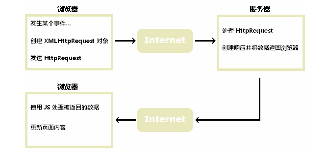

+ 简单来说,我们之前发的请求通过类似  form表单标签,a标签 这种方式,现在通过 运行js代码动态决定什么时候发送什么样的请求
+ 通过运行JS代码发送的请求浏览器可以不用跳转页面 ,我们可以在JS代码中决定是否要跳转页面
+ 通过运行JS代码发送的请求,接收到返回结果后,我们可以将结果通过dom编程渲染到页面的某些元素上,实现局部更新

## 4.2 如何实现Ajax请求

+ index页面

```html
<!DOCTYPE html>
<html lang="en">
<head>
    <meta charset="UTF-8">
    <title>Title</title>
    <script>
        function getMessage(){
            //实例化一个xmlHttpRequest
            var request = new XMLHttpRequest();
            //设置xmlHttpRequest对象的回调函数
            //request.readState   1 2 3 4
            //request.status      响应状态码，响应行状态码
            request.onreadystatechange = function (){
                if(request.readyState == 4 && request.status == 200){
                    alert("后端响应了")
                    console.log(request.responseText)
                    //将信息放到指定的位置
                    var elementById = document.getElementById("message");
                    elementById.value = request.responseText
                }
            }
            //设置发送请求的方式和请求的资源路径
            request.open("GET","/hello?username=zhangsan")
            //发送请求
            request.send()
        }
    </script>
</head>
<body>
<button onclick="getMessage()">按钮</button>
<input type="text" id="message">
</body>
</html>
```

+ Servlet文件

```java
@WebServlet("/hello")
public class ServletA extends HttpServlet {
    @Override
    protected void service(HttpServletRequest req, HttpServletResponse resp) throws ServletException, IOException {
        //接收参数
        String username = req.getParameter("username");
        //做出响应
        resp.getWriter().write("hello:"+username);
    }
}
```


